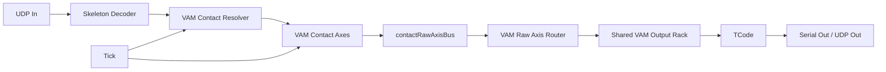
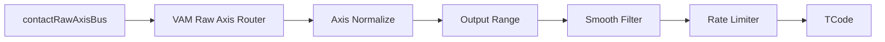
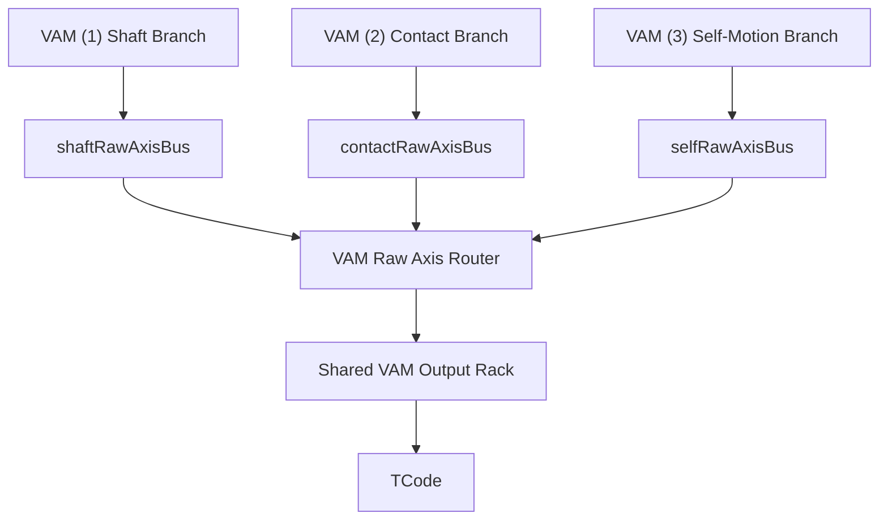

# VAM (2): Female-Female Motion

This tutorial builds the female-female contact branch for the VAM pose pipeline.
It is not a shaft-reference graph. There is no `ReferenceStart -> ReferenceEnd`
bone pair and no natural "root to tip" distance. Instead, the graph creates a
synthetic contact frame from two surface target bones.

The first practical target is:

```text
FemaleA.Vagina <-> FemaleB.Vagina
```

The same branch can later support other pairs such as:

```text
Vagina <-> Thigh
Chest <-> Chest
Hand <-> Vagina
```

## Mental Model

Classic VAM shaft mode answers:

```text
Where is the target along this shaft?
```

Female-female contact mode answers:

```text
How close are these two target surfaces, and how are they sliding relative to
each other?
```

So the key object is `contactFrame`:

```text
origin  = receiver target position
normal  = direction from receiver target toward driver target
tangent = receiver local right projected onto the contact plane
forward = tangent x normal
```

The contact branch should emit raw semantic axes. Normalization, smoothing,
rate limiting, and TCode formatting belong to the shared VAM output rack.

## Graph Overview



The same graph as Studio wiring:

```text
UDP In.packet -> Skeleton Decoder.packet
Skeleton Decoder.skeletons -> VAM Contact Resolver.skeletons
Tick.exec -> VAM Contact Resolver.exec

VAM Contact Resolver.contactFrame -> VAM Contact Axes.contactFrame
VAM Contact Resolver.receiverWorldBone -> VAM Contact Axes.receiverWorldBone
VAM Contact Resolver.driverWorldBone -> VAM Contact Axes.driverWorldBone
VAM Contact Resolver.driverInContact -> VAM Contact Axes.driverInContact
Tick.exec -> VAM Contact Axes.exec

VAM Contact Axes raw outputs -> contactRawAxisBus
contactRawAxisBus -> VAM Raw Axis Router.contactRawAxes
VAM Raw Axis Router.<axis>_raw -> Shared VAM Output Rack
Shared VAM Output Rack -> TCode.L0/L1/L2
```

## Layer Contract

| Layer | Input | Output | Owns |
| --- | --- | --- | --- |
| Ingest | UDP packet | skeleton cache | network and binary format |
| Contact resolver | skeleton cache | receiver bone, driver bone, contact frame, relative pose | pair selection and frame construction |
| Contact axes | contact pose objects | raw distance/slide axes | geometric projection and frame-to-frame deltas |
| Raw bus | raw distance/slide axes | `contactRawAxisBus` | branch-to-unified contract |
| Shared output rack | routed raw axes | processed `0..1` values | adaptive/fixed normalization, output range, smoothing, rate limits, fallback |
| Output | processed `0..1` values | TCode string | command packaging and transport |

This separation matters. The resolver should not normalize values or build
TCode. A graph author should be able to tune distance ranges, slide sensitivity,
and smoothing without editing Python.

## Tutorial: Build The Graph From Zero

### 1. Create The Ingest Nodes

Create:

| Node | Setup |
| --- | --- |
| `UDP In` | Use the port used by `ignore/Feel8.SkeletonStreamer`. |
| `Skeleton Decoder` | Leave `selectedKey` empty while debugging so all skeletons are visible. |
| `Tick` | Start around `30..60 Hz`. |

Wire:

```text
UDP In.packet -> Skeleton Decoder.packet
```

### 2. Add `VAM Contact Resolver`

Create a `Python Script` node and rename it to `VAM Contact Resolver`.

Set `inputMode` to:

```text
raw_dict
```

Add data input ports:

| Port | Purpose |
| --- | --- |
| `skeletons` | Connect from `Skeleton Decoder.skeletons`. |

Add data output ports:

| Port | Purpose |
| --- | --- |
| `contactFrame` | Synthetic contact coordinate frame. |
| `receiverWorldBone` | Receiver target bone in world space. |
| `driverWorldBone` | Driver target bone in world space. |
| `driverInContact` | Driver target position/rotation relative to the contact frame. |
| `status` | Small validity and selection object. |
| `debug` | Richer inspection object for viewers. |

Add state fields:

| State field | Type | Default | Purpose |
| --- | --- | --- | --- |
| `trackingMode` | string | `manual` | `manual` or `auto`. Start with `manual` for predictable setup. |
| `receiverKey` | string | empty | Receiver skeleton key, for example the first female atom/model name. |
| `driverKey` | string | empty | Driver skeleton key, for example the second female atom/model name. |
| `receiverBone` | string | `Vagina` | Receiver target bone. |
| `driverBone` | string | `Vagina` | Driver target bone. |
| `contactBones` | array | `["Vagina"]` | Auto-mode candidate bones. Use `uiControl=multiselect` and `valueSchema.items.enum`. |
| `pairSwitchMargin` | number | `0.03` | Auto-mode hysteresis in meters. A new pair must be this much closer before switching. |
| `receiverUpOffset` | number | `0.0` | Optional offset along receiver local up, in meters. |
| `driverUpOffset` | number | `0.0` | Optional offset along driver local up, in meters. |
| `availableContactKeys` | array | `[]` | Optional diagnostic list written only when the field exists. |
| `availableContactBones` | array | `[]` | Optional diagnostic target bone choices seen in the current stream. |
| `lockedReceiverKey` | string | empty | Optional diagnostic receiver key. |
| `lockedDriverKey` | string | empty | Optional diagnostic driver key. |
| `lockedReceiverBone` | string | empty | Optional diagnostic receiver bone. |
| `lockedDriverBone` | string | empty | Optional diagnostic driver bone. |
| `lastContactReason` | string | empty | Optional low-frequency diagnostic reason. |

Use this schema shape for `contactBones`:

```json
{
  "type": "array",
  "items": {
    "type": "string",
    "enum": [
      "Vagina",
      "Mouth",
      "Anus",
      "LeftHand",
      "RightHand",
      "LeftFoot",
      "RightFoot",
      "Feet",
      "Chest",
      "LeftNipple",
      "RightNipple"
    ]
  },
  "default": ["Vagina"]
}
```

For the first working graph, set:

```text
trackingMode = manual
receiverBone = Vagina
driverBone = Vagina
```

Then fill `receiverKey` and `driverKey` from the two skeleton model names shown
by `Skeleton Decoder.skeletons`.

Paste this script into `VAM Contact Resolver`:

```python
from __future__ import annotations

import math
from typing import TYPE_CHECKING, Any

if TYPE_CHECKING:
    from f8_script_api import F8Inputs, F8PyEngineContext

Vec3 = tuple[float, float, float]
Quat = tuple[float, float, float, float]

EPS = 1.0e-8
CONTACT_BONE_CHOICES = (
    "Vagina",
    "Mouth",
    "Anus",
    "LeftHand",
    "RightHand",
    "LeftFoot",
    "RightFoot",
    "Feet",
    "Chest",
    "LeftNipple",
    "RightNipple",
)
DEFAULT_CONTACT_BONES = ("Vagina",)


def _state_text(ctx: "F8PyEngineContext", field: str, default: str) -> str:
    value = ctx.states.get(field, default)
    if value is None:
        return default
    return str(value).strip()


def _state_float(ctx: "F8PyEngineContext", field: str, default: float) -> float:
    value = ctx.states.get(field, default)
    if isinstance(value, bool) or value is None:
        return default
    if isinstance(value, (int, float)):
        return float(value)
    if isinstance(value, str):
        text = value.strip()
        if not text:
            return default
        try:
            return float(text)
        except ValueError:
            return default
    return default


def _state_string_list(ctx: "F8PyEngineContext", field: str, default: tuple[str, ...]) -> list[str]:
    value = ctx.states.get(field, list(default))
    if value is None:
        return list(default)
    if isinstance(value, list):
        names: list[str] = []
        for item in value:
            if isinstance(item, str):
                text = item.strip()
                if text:
                    names.append(text)
        return names
    if isinstance(value, tuple):
        names = []
        for item in value:
            if isinstance(item, str):
                text = item.strip()
                if text:
                    names.append(text)
        return names
    if isinstance(value, str):
        text = value.strip()
        if not text:
            return []
        return [part.strip() for part in text.split(",") if part.strip()]
    return list(default)


def _set_state_if_changed(ctx: "F8PyEngineContext", field: str, value: Any) -> None:
    if field not in ctx.states:
        return
    cache_raw = ctx.locals.setdefault("state_cache", {})
    if not isinstance(cache_raw, dict):
        cache_raw = {}
        ctx.locals["state_cache"] = cache_raw
    previous = cache_raw.get(field)
    if previous != value:
        cache_raw[field] = value
        ctx.set_state(field, value)


def _lock_value(ctx: "F8PyEngineContext", field: str) -> str:
    value = ctx.locals.get(field)
    if isinstance(value, str):
        return value
    return ""


def _set_pair_lock(ctx: "F8PyEngineContext", receiver_key: str, driver_key: str, receiver_bone: str, driver_bone: str) -> None:
    ctx.locals["locked_receiver_key"] = receiver_key
    ctx.locals["locked_driver_key"] = driver_key
    ctx.locals["locked_receiver_bone"] = receiver_bone
    ctx.locals["locked_driver_bone"] = driver_bone


def _clear_pair_lock(ctx: "F8PyEngineContext") -> None:
    ctx.locals["locked_receiver_key"] = ""
    ctx.locals["locked_driver_key"] = ""
    ctx.locals["locked_receiver_bone"] = ""
    ctx.locals["locked_driver_bone"] = ""


def _v_add(a: Vec3, b: Vec3) -> Vec3:
    return (a[0] + b[0], a[1] + b[1], a[2] + b[2])


def _v_sub(a: Vec3, b: Vec3) -> Vec3:
    return (a[0] - b[0], a[1] - b[1], a[2] - b[2])


def _v_scale(v: Vec3, scale: float) -> Vec3:
    return (v[0] * scale, v[1] * scale, v[2] * scale)


def _dot(a: Vec3, b: Vec3) -> float:
    return a[0] * b[0] + a[1] * b[1] + a[2] * b[2]


def _cross(a: Vec3, b: Vec3) -> Vec3:
    return (
        a[1] * b[2] - a[2] * b[1],
        a[2] * b[0] - a[0] * b[2],
        a[0] * b[1] - a[1] * b[0],
    )


def _length(v: Vec3) -> float:
    return math.sqrt(_dot(v, v))


def _normalize(v: Vec3) -> Vec3:
    value = _length(v)
    if value <= EPS:
        raise ValueError("cannot normalize a near-zero vector")
    return _v_scale(v, 1.0 / value)


def _project(v: Vec3, axis: Vec3) -> Vec3:
    axis_n = _normalize(axis)
    return _v_scale(axis_n, _dot(v, axis_n))


def _project_on_plane(v: Vec3, normal: Vec3) -> Vec3:
    return _v_sub(v, _project(v, normal))


def _as_vec3(value: Any, label: str) -> Vec3:
    if not isinstance(value, (list, tuple)) or len(value) < 3:
        raise ValueError(f"{label} must be a 3-element vector")
    return (float(value[0]), float(value[1]), float(value[2]))


def _as_quat(value: Any, label: str) -> Quat:
    if not isinstance(value, (list, tuple)) or len(value) < 4:
        raise ValueError(f"{label} must be a 4-element quaternion [w, x, y, z]")
    return _quat_normalize((float(value[0]), float(value[1]), float(value[2]), float(value[3])))


def _to_list3(v: Vec3) -> list[float]:
    return [float(v[0]), float(v[1]), float(v[2])]


def _to_list4(q: Quat) -> list[float]:
    return [float(q[0]), float(q[1]), float(q[2]), float(q[3])]


def _quat_normalize(q: Quat) -> Quat:
    value = math.sqrt(q[0] * q[0] + q[1] * q[1] + q[2] * q[2] + q[3] * q[3])
    if value <= EPS:
        raise ValueError("cannot normalize a near-zero quaternion")
    return (q[0] / value, q[1] / value, q[2] / value, q[3] / value)


def _quat_inverse(q: Quat) -> Quat:
    qn = _quat_normalize(q)
    return (qn[0], -qn[1], -qn[2], -qn[3])


def _quat_mul(a: Quat, b: Quat) -> Quat:
    aw, ax, ay, az = a
    bw, bx, by, bz = b
    return _quat_normalize(
        (
            aw * bw - ax * bx - ay * by - az * bz,
            aw * bx + ax * bw + ay * bz - az * by,
            aw * by - ax * bz + ay * bw + az * bx,
            aw * bz + ax * by - ay * bx + az * bw,
        )
    )


def _quat_rotate(q: Quat, v: Vec3) -> Vec3:
    qn = _quat_normalize(q)
    w = qn[0]
    qv = (qn[1], qn[2], qn[3])
    t = _v_scale(_cross(qv, v), 2.0)
    return _v_add(_v_add(v, _v_scale(t, w)), _cross(qv, t))


def _quat_from_basis(right: Vec3, up: Vec3, forward: Vec3) -> Quat:
    r = _normalize(right)
    u = _normalize(up)
    f = _normalize(forward)
    m00, m01, m02 = r[0], u[0], f[0]
    m10, m11, m12 = r[1], u[1], f[1]
    m20, m21, m22 = r[2], u[2], f[2]
    trace = m00 + m11 + m22
    if trace > 0.0:
        scale = math.sqrt(trace + 1.0) * 2.0
        return _quat_normalize((0.25 * scale, (m21 - m12) / scale, (m02 - m20) / scale, (m10 - m01) / scale))
    if m00 > m11 and m00 > m22:
        scale = math.sqrt(1.0 + m00 - m11 - m22) * 2.0
        return _quat_normalize(((m21 - m12) / scale, 0.25 * scale, (m01 + m10) / scale, (m02 + m20) / scale))
    if m11 > m22:
        scale = math.sqrt(1.0 + m11 - m00 - m22) * 2.0
        return _quat_normalize(((m02 - m20) / scale, (m01 + m10) / scale, 0.25 * scale, (m12 + m21) / scale))
    scale = math.sqrt(1.0 + m22 - m00 - m11) * 2.0
    return _quat_normalize(((m10 - m01) / scale, (m02 + m20) / scale, (m12 + m21) / scale, 0.25 * scale))


def _perpendicular_axis(up: Vec3) -> Vec3:
    up_n = _normalize(up)
    world_x = (1.0, 0.0, 0.0)
    world_z = (0.0, 0.0, 1.0)
    seed = world_x if abs(_dot(up_n, world_x)) < 0.9 else world_z
    return _normalize(_project_on_plane(seed, up_n))


def _skeleton_key(skeleton: dict[str, Any]) -> str:
    value = skeleton.get("modelName")
    if value is None:
        return ""
    return str(value).strip()


def _skeleton_schema(skeleton: dict[str, Any]) -> str:
    value = skeleton.get("schema")
    if value is None:
        return ""
    return str(value).strip()


def _bone_map(skeleton: dict[str, Any]) -> dict[str, dict[str, Any]]:
    bones_raw = skeleton.get("bones")
    if not isinstance(bones_raw, list):
        return {}
    bones: dict[str, dict[str, Any]] = {}
    for item in bones_raw:
        if not isinstance(item, dict):
            continue
        name = item.get("name")
        if isinstance(name, str) and name:
            bones[name] = item
    return bones


def _looks_like_json_schema(value: Any) -> bool:
    if not isinstance(value, dict):
        return False
    value_type = value.get("type")
    if value_type not in ("array", "object"):
        return False
    return "properties" in value or "items" in value


def _input_skeletons(inputs: dict[str, Any]) -> list[dict[str, Any]]:
    skeletons_raw = inputs.get("skeletons")
    if skeletons_raw is None:
        skeletons_raw = inputs.get("msg")
    if skeletons_raw is None:
        return []
    if _looks_like_json_schema(skeletons_raw):
        raise ValueError("input 'skeletons' is a JSON Schema, not live skeleton data")
    if isinstance(skeletons_raw, dict):
        return [skeletons_raw]
    if isinstance(skeletons_raw, list):
        skeletons: list[dict[str, Any]] = []
        for item in skeletons_raw:
            if _looks_like_json_schema(item):
                raise ValueError("input 'skeletons' contains a JSON Schema item, not live skeleton data")
            if isinstance(item, dict):
                skeletons.append(item)
        return skeletons
    raise ValueError("VAM Contact Resolver expects input 'skeletons' to be a skeleton dict or list")


def _bone_world(skeleton: dict[str, Any], bone: dict[str, Any], name: str, up_offset: float) -> dict[str, Any]:
    pos = _as_vec3(bone.get("pos"), "bone.pos")
    rot = _as_quat(bone.get("rot"), "bone.rot")
    right = _normalize(_quat_rotate(rot, (1.0, 0.0, 0.0)))
    up = _normalize(_quat_rotate(rot, (0.0, 1.0, 0.0)))
    forward = _normalize(_quat_rotate(rot, (0.0, 0.0, 1.0)))
    pos = _v_add(pos, _v_scale(up, up_offset))
    return {
        "valid": True,
        "key": _skeleton_key(skeleton),
        "schema": _skeleton_schema(skeleton),
        "name": name,
        "pos": _to_list3(pos),
        "rot": _to_list4(rot),
        "right": _to_list3(right),
        "up": _to_list3(up),
        "forward": _to_list3(forward),
    }


def _build_contact_frame(receiver: dict[str, Any], driver: dict[str, Any]) -> dict[str, Any]:
    receiver_pos = _as_vec3(receiver.get("pos"), "receiver.pos")
    driver_pos = _as_vec3(driver.get("pos"), "driver.pos")
    receiver_right = _as_vec3(receiver.get("right"), "receiver.right")
    receiver_up = _as_vec3(receiver.get("up"), "receiver.up")
    receiver_forward = _as_vec3(receiver.get("forward"), "receiver.forward")
    delta = _v_sub(driver_pos, receiver_pos)

    if _length(delta) > EPS:
        normal = _normalize(delta)
    else:
        normal = _normalize(receiver_up)

    tangent = _project_on_plane(receiver_right, normal)
    if _length(tangent) <= EPS:
        tangent = _project_on_plane(receiver_forward, normal)
    if _length(tangent) <= EPS:
        tangent = _perpendicular_axis(normal)
    tangent = _normalize(tangent)
    forward = _normalize(_cross(tangent, normal))
    tangent = _normalize(_cross(normal, forward))
    rot = _quat_from_basis(tangent, normal, forward)

    return {
        "valid": True,
        "kind": "surfaceContact",
        "receiverKey": receiver.get("key", ""),
        "driverKey": driver.get("key", ""),
        "receiverBone": receiver.get("name", ""),
        "driverBone": driver.get("name", ""),
        "pos": _to_list3(receiver_pos),
        "rot": _to_list4(rot),
        "normal": _to_list3(normal),
        "tangent": _to_list3(tangent),
        "forward": _to_list3(forward),
        "distance": float(_length(delta)),
    }


def _driver_in_contact(contact: dict[str, Any], receiver: dict[str, Any], driver: dict[str, Any]) -> dict[str, Any]:
    origin = _as_vec3(contact.get("pos"), "contact.pos")
    normal = _as_vec3(contact.get("normal"), "contact.normal")
    forward = _as_vec3(contact.get("forward"), "contact.forward")
    tangent = _as_vec3(contact.get("tangent"), "contact.tangent")
    driver_pos = _as_vec3(driver.get("pos"), "driver.pos")
    driver_rot = _as_quat(driver.get("rot"), "driver.rot")
    contact_rot = _as_quat(contact.get("rot"), "contact.rot")
    delta = _v_sub(driver_pos, origin)
    return {
        "valid": True,
        "name": "DriverInContact",
        "receiverKey": receiver.get("key", ""),
        "driverKey": driver.get("key", ""),
        "receiverBone": receiver.get("name", ""),
        "driverBone": driver.get("name", ""),
        "pos": [float(_dot(delta, normal)), float(_dot(delta, forward)), float(_dot(delta, tangent))],
        "rot": _to_list4(_quat_mul(_quat_inverse(contact_rot), driver_rot)),
    }


def _collect_entries(skeletons: list[dict[str, Any]]) -> list[dict[str, Any]]:
    entries: list[dict[str, Any]] = []
    for skeleton in skeletons:
        key = _skeleton_key(skeleton)
        if not key:
            continue
        bones = _bone_map(skeleton)
        contact_bones = [name for name in CONTACT_BONE_CHOICES if name in bones]
        if contact_bones:
            entries.append({"key": key, "skeleton": skeleton, "bones": bones, "contactBones": contact_bones})
    return entries


def _enabled_contact_bones(ctx: "F8PyEngineContext") -> list[str]:
    selected = _state_string_list(ctx, "contactBones", DEFAULT_CONTACT_BONES)
    enabled: list[str] = []
    for name in selected:
        if name in CONTACT_BONE_CHOICES and name not in enabled:
            enabled.append(name)
    return enabled


def _distance_between(receiver: dict[str, Any], driver: dict[str, Any]) -> float:
    receiver_pos = _as_vec3(receiver.get("pos"), "receiver.pos")
    driver_pos = _as_vec3(driver.get("pos"), "driver.pos")
    return _length(_v_sub(driver_pos, receiver_pos))


def _manual_pair(
    ctx: "F8PyEngineContext",
    entries: list[dict[str, Any]],
) -> tuple[dict[str, Any] | None, dict[str, Any] | None, str | None, str | None, str]:
    receiver_key = _state_text(ctx, "receiverKey", "")
    driver_key = _state_text(ctx, "driverKey", "")
    receiver_bone = _state_text(ctx, "receiverBone", "Vagina")
    driver_bone = _state_text(ctx, "driverBone", "Vagina")
    if not receiver_key:
        return None, None, None, None, "manual mode requires receiverKey"
    if not driver_key:
        return None, None, None, None, "manual mode requires driverKey"
    receiver_entry = None
    driver_entry = None
    for entry in entries:
        if entry["key"] == receiver_key:
            receiver_entry = entry
        if entry["key"] == driver_key:
            driver_entry = entry
    if receiver_entry is None:
        return None, None, None, None, f"receiverKey not found: {receiver_key}"
    if driver_entry is None:
        return None, None, None, None, f"driverKey not found: {driver_key}"
    if receiver_bone not in receiver_entry["bones"]:
        return None, None, None, None, f"receiverBone not found on {receiver_key}: {receiver_bone}"
    if driver_bone not in driver_entry["bones"]:
        return None, None, None, None, f"driverBone not found on {driver_key}: {driver_bone}"
    return receiver_entry, driver_entry, receiver_bone, driver_bone, "manual receiver/driver pair"


def _auto_candidates(
    ctx: "F8PyEngineContext",
    entries: list[dict[str, Any]],
) -> list[tuple[float, str, str, str, str, dict[str, Any], dict[str, Any]]]:
    enabled = _enabled_contact_bones(ctx)
    receiver_offset = _state_float(ctx, "receiverUpOffset", 0.0)
    driver_offset = _state_float(ctx, "driverUpOffset", 0.0)
    candidates: list[tuple[float, str, str, str, str, dict[str, Any], dict[str, Any]]] = []
    for receiver_entry in entries:
        for driver_entry in entries:
            if receiver_entry["key"] == driver_entry["key"]:
                continue
            for receiver_bone in enabled:
                if receiver_bone not in receiver_entry["bones"]:
                    continue
                receiver_world = _bone_world(receiver_entry["skeleton"], receiver_entry["bones"][receiver_bone], receiver_bone, receiver_offset)
                for driver_bone in enabled:
                    if driver_bone not in driver_entry["bones"]:
                        continue
                    driver_world = _bone_world(driver_entry["skeleton"], driver_entry["bones"][driver_bone], driver_bone, driver_offset)
                    distance = _distance_between(receiver_world, driver_world)
                    candidates.append(
                        (
                            distance,
                            str(receiver_entry["key"]),
                            str(driver_entry["key"]),
                            receiver_bone,
                            driver_bone,
                            receiver_entry,
                            driver_entry,
                        )
                    )
    return candidates


def _pick_auto_pair(
    ctx: "F8PyEngineContext",
    entries: list[dict[str, Any]],
) -> tuple[dict[str, Any] | None, dict[str, Any] | None, str | None, str | None, str]:
    candidates = _auto_candidates(ctx, entries)
    if not candidates:
        _clear_pair_lock(ctx)
        return None, None, None, None, "auto mode has no contact candidates"

    ordered = sorted(candidates, key=lambda item: (item[0], item[1], item[2], item[3], item[4]))
    best_distance, best_receiver_key, best_driver_key, best_receiver_bone, best_driver_bone, best_receiver, best_driver = ordered[0]
    locked_receiver_key = _lock_value(ctx, "locked_receiver_key")
    locked_driver_key = _lock_value(ctx, "locked_driver_key")
    locked_receiver_bone = _lock_value(ctx, "locked_receiver_bone")
    locked_driver_bone = _lock_value(ctx, "locked_driver_bone")
    margin = max(0.0, _state_float(ctx, "pairSwitchMargin", 0.03))

    locked_candidate: tuple[float, str, str, str, str, dict[str, Any], dict[str, Any]] | None = None
    if locked_receiver_key and locked_driver_key and locked_receiver_bone and locked_driver_bone:
        for candidate in ordered:
            distance, receiver_key, driver_key, receiver_bone, driver_bone, receiver_entry, driver_entry = candidate
            if (
                receiver_key == locked_receiver_key
                and driver_key == locked_driver_key
                and receiver_bone == locked_receiver_bone
                and driver_bone == locked_driver_bone
            ):
                locked_candidate = (distance, receiver_key, driver_key, receiver_bone, driver_bone, receiver_entry, driver_entry)
                break

    if locked_candidate is not None:
        locked_distance, receiver_key, driver_key, receiver_bone, driver_bone, receiver_entry, driver_entry = locked_candidate
        if best_distance + margin >= locked_distance:
            _set_pair_lock(ctx, receiver_key, driver_key, receiver_bone, driver_bone)
            return receiver_entry, driver_entry, receiver_bone, driver_bone, f"auto kept locked pair {receiver_key}.{receiver_bone} <- {driver_key}.{driver_bone}"

    _set_pair_lock(ctx, best_receiver_key, best_driver_key, best_receiver_bone, best_driver_bone)
    return best_receiver, best_driver, best_receiver_bone, best_driver_bone, f"auto selected nearest pair {best_receiver_key}.{best_receiver_bone} <- {best_driver_key}.{best_driver_bone}"


def _invalid_outputs(reason: str, debug: dict[str, Any] | None = None) -> dict[str, Any]:
    status = {"valid": False, "reason": reason, "receiverKey": "", "driverKey": "", "receiverBone": "", "driverBone": ""}
    return {
        "contactFrame": {"valid": False, "reason": reason},
        "receiverWorldBone": {"valid": False, "reason": reason},
        "driverWorldBone": {"valid": False, "reason": reason},
        "driverInContact": {"valid": False, "reason": reason},
        "status": status,
        "debug": debug or {"valid": False, "reason": reason},
    }


def _run_resolver(ctx: "F8PyEngineContext", inputs: dict[str, Any]) -> dict[str, Any]:
    skeletons = _input_skeletons(inputs)
    entries = _collect_entries(skeletons)
    keys = [str(entry["key"]) for entry in entries]
    seen_bones: list[str] = []
    for entry in entries:
        for bone_name in entry["contactBones"]:
            if bone_name not in seen_bones:
                seen_bones.append(bone_name)
    _set_state_if_changed(ctx, "availableContactKeys", keys)
    _set_state_if_changed(ctx, "availableContactBones", seen_bones)

    debug_base = {"valid": False, "skeletonCount": len(skeletons), "availableContactKeys": keys, "availableContactBones": seen_bones}
    if not skeletons:
        _clear_pair_lock(ctx)
        _set_state_if_changed(ctx, "lastContactReason", "no skeletons input")
        return _invalid_outputs("no skeletons input", debug_base)
    if len(entries) < 2:
        _clear_pair_lock(ctx)
        _set_state_if_changed(ctx, "lastContactReason", "need at least two contact-capable skeletons")
        return _invalid_outputs("need at least two contact-capable skeletons", debug_base)

    tracking_mode = _state_text(ctx, "trackingMode", "manual").lower()
    manual = tracking_mode == "manual"
    if manual:
        _clear_pair_lock(ctx)
        receiver_entry, driver_entry, receiver_bone_name, driver_bone_name, reason = _manual_pair(ctx, entries)
    else:
        receiver_entry, driver_entry, receiver_bone_name, driver_bone_name, reason = _pick_auto_pair(ctx, entries)

    if receiver_entry is None or driver_entry is None or receiver_bone_name is None or driver_bone_name is None:
        _set_state_if_changed(ctx, "lockedReceiverKey", "")
        _set_state_if_changed(ctx, "lockedDriverKey", "")
        _set_state_if_changed(ctx, "lockedReceiverBone", "")
        _set_state_if_changed(ctx, "lockedDriverBone", "")
        _set_state_if_changed(ctx, "lastContactReason", reason)
        return _invalid_outputs(reason, debug_base)

    receiver_offset = _state_float(ctx, "receiverUpOffset", 0.0)
    driver_offset = _state_float(ctx, "driverUpOffset", 0.0)
    receiver_world = _bone_world(receiver_entry["skeleton"], receiver_entry["bones"][receiver_bone_name], receiver_bone_name, receiver_offset)
    driver_world = _bone_world(driver_entry["skeleton"], driver_entry["bones"][driver_bone_name], driver_bone_name, driver_offset)
    contact_frame = _build_contact_frame(receiver_world, driver_world)
    driver_in_contact = _driver_in_contact(contact_frame, receiver_world, driver_world)

    status = {
        "valid": True,
        "reason": reason,
        "trackingMode": tracking_mode,
        "receiverKey": receiver_world["key"],
        "driverKey": driver_world["key"],
        "receiverBone": receiver_world["name"],
        "driverBone": driver_world["name"],
        "distance": contact_frame["distance"],
    }
    debug = {
        "valid": True,
        "skeletonCount": len(skeletons),
        "availableContactKeys": keys,
        "availableContactBones": seen_bones,
        "contactFrame": contact_frame,
        "receiverWorldBone": receiver_world,
        "driverWorldBone": driver_world,
        "driverInContact": driver_in_contact,
        "status": status,
    }

    _set_state_if_changed(ctx, "lockedReceiverKey", str(receiver_world["key"]))
    _set_state_if_changed(ctx, "lockedDriverKey", str(driver_world["key"]))
    _set_state_if_changed(ctx, "lockedReceiverBone", str(receiver_world["name"]))
    _set_state_if_changed(ctx, "lockedDriverBone", str(driver_world["name"]))
    _set_state_if_changed(ctx, "lastContactReason", reason)

    return {
        "contactFrame": contact_frame,
        "receiverWorldBone": receiver_world,
        "driverWorldBone": driver_world,
        "driverInContact": driver_in_contact,
        "status": status,
        "debug": debug,
    }


def onStart(ctx: "F8PyEngineContext") -> None:
    ctx.log("VAM Contact Resolver started")


def onMsg(ctx: "F8PyEngineContext", inputs: "F8Inputs") -> dict[str, Any]:
    outputs = _run_resolver(ctx, inputs)
    return {"outputs": outputs}


def onExec(ctx: "F8PyEngineContext", exec_in: str, inputs: "F8Inputs") -> dict[str, Any]:
    outputs = _run_resolver(ctx, inputs)
    return {"exec": ["exec"], "outputs": outputs}


def onStop(ctx: "F8PyEngineContext") -> None:
    ctx.log("VAM Contact Resolver stopped")
```

### 3. Inspect The Contact Pose

Before adding TCode, connect these outputs to a data viewer:

```text
VAM Contact Resolver.status
VAM Contact Resolver.contactFrame
VAM Contact Resolver.driverInContact
```

Check:

- `status.valid` is `true`.
- `contactFrame.distance` changes as the two targets move closer or farther.
- `driverInContact.pos[0]` is the normal/contact distance component.
- `driverInContact.pos[1]` and `driverInContact.pos[2]` are plane sliding
  components.

If `status.valid=false`, first confirm that:

- both female skeleton streams are present in `Skeleton Decoder.skeletons`;
- `receiverKey` and `driverKey` match the stream `modelName` values exactly;
- both selected bones exist on those skeletons.

### 4. Add `VAM Contact Axes`

Create another `Python Script` node and rename it to `VAM Contact Axes`.

Set `inputMode` to:

```text
raw_dict
```

Add data input ports:

| Port | Connect from |
| --- | --- |
| `contactFrame` | `VAM Contact Resolver.contactFrame` |
| `receiverWorldBone` | `VAM Contact Resolver.receiverWorldBone` |
| `driverWorldBone` | `VAM Contact Resolver.driverWorldBone` |
| `driverInContact` | `VAM Contact Resolver.driverInContact` |

Add data output ports:

| Port | Meaning |
| --- | --- |
| `L0_distance_m` | Normal distance between receiver and driver. Usually invert this when mapping to `0..1`. |
| `L1_slideForward_m` | Driver offset along contact forward. |
| `L2_slideRight_m` | Driver offset along contact tangent/right. |
| `slideDelta_m` | Frame-to-frame plane sliding distance. Useful for vibration-like effects. |
| `slideSpeed_mps` | Approximate sliding speed. |
| `distanceDelta_m` | Frame-to-frame normal distance change. |
| `axes` | Combined axis object. |
| `status` | Small validity object. |

Add state fields:

| State field | Type | Default | Purpose |
| --- | --- | --- | --- |
| `sampleMs` | number | `33.333` | Time step used for speed estimation. Match your Tick cadence. |
| `slideDeadband` | number | `0.001` | Ignore tiny frame-to-frame slide jitter in meters. |

Wire:

```text
VAM Contact Resolver.contactFrame -> VAM Contact Axes.contactFrame
VAM Contact Resolver.receiverWorldBone -> VAM Contact Axes.receiverWorldBone
VAM Contact Resolver.driverWorldBone -> VAM Contact Axes.driverWorldBone
VAM Contact Resolver.driverInContact -> VAM Contact Axes.driverInContact
Tick.exec -> VAM Contact Axes.exec
```

Paste this script into `VAM Contact Axes`:

```python
from __future__ import annotations

import math
from typing import TYPE_CHECKING, Any

if TYPE_CHECKING:
    from f8_script_api import F8Inputs, F8PyEngineContext


def _state_float(ctx: "F8PyEngineContext", field: str, default: float) -> float:
    value = ctx.states.get(field, default)
    if isinstance(value, bool) or value is None:
        return default
    if isinstance(value, (int, float)):
        return float(value)
    if isinstance(value, str):
        text = value.strip()
        if not text:
            return default
        try:
            return float(text)
        except ValueError:
            return default
    return default


def _valid_pose(value: Any) -> bool:
    return isinstance(value, dict) and value.get("valid") is True


def _pos3(value: Any, label: str) -> tuple[float, float, float]:
    if not isinstance(value, (list, tuple)) or len(value) < 3:
        raise ValueError(f"{label} must be a 3-element vector")
    return (float(value[0]), float(value[1]), float(value[2]))


def _invalid(reason: str) -> dict[str, Any]:
    axes = {
        "valid": False,
        "reason": reason,
        "L0_distance_m": 0.0,
        "L1_slideForward_m": 0.0,
        "L2_slideRight_m": 0.0,
        "slideDelta_m": 0.0,
        "slideSpeed_mps": 0.0,
        "distanceDelta_m": 0.0,
    }
    return {
        "L0_distance_m": 0.0,
        "L1_slideForward_m": 0.0,
        "L2_slideRight_m": 0.0,
        "slideDelta_m": 0.0,
        "slideSpeed_mps": 0.0,
        "distanceDelta_m": 0.0,
        "axes": axes,
        "status": {"valid": False, "reason": reason},
    }


def _run_axes(ctx: "F8PyEngineContext", inputs: dict[str, Any]) -> dict[str, Any]:
    contact_frame = inputs.get("contactFrame")
    receiver_world = inputs.get("receiverWorldBone")
    driver_world = inputs.get("driverWorldBone")
    driver_in_contact = inputs.get("driverInContact")

    if not _valid_pose(contact_frame):
        return _invalid("contactFrame is invalid")
    if not _valid_pose(receiver_world):
        return _invalid("receiverWorldBone is invalid")
    if not _valid_pose(driver_world):
        return _invalid("driverWorldBone is invalid")
    if not _valid_pose(driver_in_contact):
        return _invalid("driverInContact is invalid")

    rel_pos = _pos3(driver_in_contact.get("pos"), "driverInContact.pos")
    distance_m = float(rel_pos[0])
    slide_forward_m = float(rel_pos[1])
    slide_right_m = float(rel_pos[2])

    previous_raw = ctx.locals.get("previous_contact_axes")
    previous = previous_raw if isinstance(previous_raw, dict) else None
    if previous is None:
        slide_delta_m = 0.0
        distance_delta_m = 0.0
    else:
        previous_forward = float(previous.get("slideForward", slide_forward_m))
        previous_right = float(previous.get("slideRight", slide_right_m))
        previous_distance = float(previous.get("distance", distance_m))
        delta_forward = slide_forward_m - previous_forward
        delta_right = slide_right_m - previous_right
        slide_delta_m = math.sqrt(delta_forward * delta_forward + delta_right * delta_right)
        distance_delta_m = distance_m - previous_distance

    deadband = max(0.0, _state_float(ctx, "slideDeadband", 0.001))
    if slide_delta_m < deadband:
        slide_delta_m = 0.0

    sample_ms = max(1.0, _state_float(ctx, "sampleMs", 33.333))
    slide_speed_mps = slide_delta_m / (sample_ms / 1000.0)

    ctx.locals["previous_contact_axes"] = {
        "distance": distance_m,
        "slideForward": slide_forward_m,
        "slideRight": slide_right_m,
    }

    axes = {
        "valid": True,
        "receiverKey": receiver_world.get("key", ""),
        "driverKey": driver_world.get("key", ""),
        "receiverBone": receiver_world.get("name", ""),
        "driverBone": driver_world.get("name", ""),
        "L0_distance_m": distance_m,
        "L1_slideForward_m": slide_forward_m,
        "L2_slideRight_m": slide_right_m,
        "slideDelta_m": slide_delta_m,
        "slideSpeed_mps": slide_speed_mps,
        "distanceDelta_m": distance_delta_m,
    }
    return {
        "L0_distance_m": axes["L0_distance_m"],
        "L1_slideForward_m": axes["L1_slideForward_m"],
        "L2_slideRight_m": axes["L2_slideRight_m"],
        "slideDelta_m": axes["slideDelta_m"],
        "slideSpeed_mps": axes["slideSpeed_mps"],
        "distanceDelta_m": axes["distanceDelta_m"],
        "axes": axes,
        "status": {"valid": True, "receiverKey": axes["receiverKey"], "driverKey": axes["driverKey"]},
    }


def onStart(ctx: "F8PyEngineContext") -> None:
    ctx.log("VAM Contact Axes started")


def onMsg(ctx: "F8PyEngineContext", inputs: "F8Inputs") -> dict[str, Any]:
    outputs = _run_axes(ctx, inputs)
    return {"outputs": outputs}


def onExec(ctx: "F8PyEngineContext", exec_in: str, inputs: "F8Inputs") -> dict[str, Any]:
    outputs = _run_axes(ctx, inputs)
    return {"exec": ["exec"], "outputs": outputs}


def onStop(ctx: "F8PyEngineContext") -> None:
    ctx.log("VAM Contact Axes stopped")
```

### 5. Pack The Contact Raw Axis Bus

Contact mode has no shaft length. The branch should emit raw contact semantics
and let the shared VAM output rack normalize them.

Recommended raw bus:

| Bus field | Source | Unit | Meaning |
| --- | --- | --- | --- |
| `L0` | `L0_distance_m` | `m` | Contact distance. The rack usually inverts this so close contact is high. |
| `L1` | `L1_slideForward_m` | `m` | Forward/back slide in the contact frame. |
| `L2` | `L2_slideRight_m` | `m` | Side slide in the contact frame. |
| `R0` | optional | `deg` | Reserved for twist-like contact rotation. |
| `R1` | optional | `deg` | Reserved for pitch-like contact rotation. |
| `R2` | optional | `deg` | Reserved for roll-like contact rotation. |

Example bus:

```python
{
    "valid": True,
    "mode": "contact",
    "confidence": confidence,
    "L0": L0_distance_m,
    "L1": L1_slideForward_m,
    "L2": L2_slideRight_m,
    "R0": 0.0,
    "R1": 0.0,
    "R2": 0.0,
    "units": {
        "L0": "m",
        "L1": "m",
        "L2": "m",
        "R0": "deg",
        "R1": "deg",
        "R2": "deg",
    },
    "reason": reason,
}
```

The shared rack can use fixed `Range Map` nodes or the adaptive normalizer below
to turn these raw values into `0..1` commands.

### 6. Optional `Adaptive Range Normalizer` For The Shared Rack

Create one `Python Script` node per raw axis and rename it with the axis name,
for example:

```text
Adaptive Normalize: Contact Distance
Adaptive Normalize: Slide Forward
Adaptive Normalize: Slide Right
```

Set `inputMode` to:

```text
raw_dict
```

Add data input ports:

| Port | Purpose |
| --- | --- |
| `value` | Raw numeric input. |

Add data output ports:

| Port | Purpose |
| --- | --- |
| `norm01` | Normalized `0..1` output. |
| `range` | Current learned lower/upper range. |
| `status` | Small validity object. |

Add state fields:

| State field | Type | Default | Purpose |
| --- | --- | --- |
| `initialMin` | number | `0.0` | Initial lower bound. |
| `initialMax` | number | `0.2` | Initial upper bound. |
| `padding` | number | `0.005` | Extra padding added around the learned range. |
| `contractRate` | number | `0.001` | Slow contraction rate for bounds when motion becomes smaller. |
| `invert` | boolean | `false` | Set `true` for distance so close maps high. |
| `freeze` | boolean | `false` | Stop learning and keep the current range. |
| `learnedMin` | number | `0.0` | Optional diagnostic written only when the field exists. |
| `learnedMax` | number | `0.0` | Optional diagnostic written only when the field exists. |

Paste this script:

```python
from __future__ import annotations

from typing import TYPE_CHECKING, Any

if TYPE_CHECKING:
    from f8_script_api import F8Inputs, F8PyEngineContext


def _state_float(ctx: "F8PyEngineContext", field: str, default: float) -> float:
    value = ctx.states.get(field, default)
    if isinstance(value, bool) or value is None:
        return default
    if isinstance(value, (int, float)):
        return float(value)
    if isinstance(value, str):
        text = value.strip()
        if not text:
            return default
        try:
            return float(text)
        except ValueError:
            return default
    return default


def _state_bool(ctx: "F8PyEngineContext", field: str, default: bool) -> bool:
    value = ctx.states.get(field, default)
    if isinstance(value, bool):
        return value
    if isinstance(value, int) and not isinstance(value, bool):
        return value != 0
    if isinstance(value, float):
        return value != 0.0
    if isinstance(value, str):
        text = value.strip().lower()
        if text in ("1", "true", "yes", "on"):
            return True
        if text in ("0", "false", "no", "off"):
            return False
    return default


def _set_state_if_changed(ctx: "F8PyEngineContext", field: str, value: Any) -> None:
    if field not in ctx.states:
        return
    cache_raw = ctx.locals.setdefault("state_cache", {})
    if not isinstance(cache_raw, dict):
        cache_raw = {}
        ctx.locals["state_cache"] = cache_raw
    previous = cache_raw.get(field)
    if previous != value:
        cache_raw[field] = value
        ctx.set_state(field, value)


def _input_value(inputs: dict[str, Any]) -> float:
    raw = inputs.get("value")
    if raw is None:
        raw = inputs.get("msg")
    if isinstance(raw, bool) or raw is None:
        raise ValueError("Adaptive Range Normalizer requires numeric input 'value'")
    if isinstance(raw, (int, float)):
        return float(raw)
    if isinstance(raw, str):
        text = raw.strip()
        if not text:
            raise ValueError("Adaptive Range Normalizer received an empty string")
        return float(text)
    raise ValueError("Adaptive Range Normalizer requires numeric input 'value'")


def _clamp01(value: float) -> float:
    return max(0.0, min(1.0, value))


def _run_normalizer(ctx: "F8PyEngineContext", inputs: dict[str, Any]) -> dict[str, Any]:
    value = _input_value(inputs)
    initial_min = _state_float(ctx, "initialMin", 0.0)
    initial_max = _state_float(ctx, "initialMax", 0.2)
    if initial_max <= initial_min:
        initial_max = initial_min + 1.0

    lower_raw = ctx.locals.get("learned_min")
    upper_raw = ctx.locals.get("learned_max")
    lower = float(lower_raw) if isinstance(lower_raw, (int, float)) else initial_min
    upper = float(upper_raw) if isinstance(upper_raw, (int, float)) else initial_max

    freeze = _state_bool(ctx, "freeze", False)
    if not freeze:
        contract_rate = max(0.0, min(1.0, _state_float(ctx, "contractRate", 0.001)))
        if value < lower:
            lower = value
        else:
            lower = lower + (value - lower) * contract_rate
        if value > upper:
            upper = value
        else:
            upper = upper + (value - upper) * contract_rate

    padding = max(0.0, _state_float(ctx, "padding", 0.005))
    range_min = lower - padding
    range_max = upper + padding
    span = range_max - range_min
    if span <= 1.0e-8:
        norm = 0.5
    else:
        norm = _clamp01((value - range_min) / span)
    if _state_bool(ctx, "invert", False):
        norm = 1.0 - norm

    ctx.locals["learned_min"] = lower
    ctx.locals["learned_max"] = upper
    _set_state_if_changed(ctx, "learnedMin", float(lower))
    _set_state_if_changed(ctx, "learnedMax", float(upper))

    range_info = {"valid": True, "input": float(value), "min": float(lower), "max": float(upper), "padding": float(padding)}
    return {
        "norm01": float(norm),
        "range": range_info,
        "status": {"valid": True, "input": float(value), "norm01": float(norm)},
    }


def onStart(ctx: "F8PyEngineContext") -> None:
    ctx.log("Adaptive Range Normalizer started")


def onMsg(ctx: "F8PyEngineContext", inputs: "F8Inputs") -> dict[str, Any]:
    outputs = _run_normalizer(ctx, inputs)
    return {"outputs": outputs}


def onExec(ctx: "F8PyEngineContext", exec_in: str, inputs: "F8Inputs") -> dict[str, Any]:
    outputs = _run_normalizer(ctx, inputs)
    return {"exec": ["exec"], "outputs": outputs}


def onStop(ctx: "F8PyEngineContext") -> None:
    ctx.log("Adaptive Range Normalizer stopped")
```

Recommended first settings:

| Axis | `initialMin` | `initialMax` | `invert` | Notes |
| --- | --- | --- | --- | --- |
| distance -> `L0` | `0.00` | `0.20` | `true` | Close contact becomes high output. |
| slide forward -> `L1` | `-0.15` | `0.15` | `false` | Centered sliding. |
| slide right -> `L2` | `-0.15` | `0.15` | `false` | Centered sliding. |
| slide speed -> optional vibration | `0.00` | `1.00` | `false` | Tune per scene. |

### 7. Connect To The Shared Output Rack

Use the same rack as VAM (1), VAM (3), and VAM (4):



Recommended first contact normalize profiles:

| Axis | Method | Starting range | Notes |
| --- | --- | --- | --- |
| `L0` | fixed or adaptive | `0.00..0.20 m`, inverted | Close contact becomes high output. |
| `L1` | fixed or adaptive | `-0.15..0.15 m` | Forward slide. |
| `L2` | fixed or adaptive | `-0.15..0.15 m` | Side slide. |
| optional vibration | adaptive or threshold | `0.00..1.00` | Tune from `slideSpeed_mps` in a separate lane. |

## Troubleshooting

### The Resolver Says `need at least two contact-capable skeletons`

Check that `Skeleton Decoder.skeletons` contains both female streams and that
both include the selected contact bone, usually `Vagina`.

### The Receiver And Driver Are Swapped

In manual mode, swap `receiverKey` and `driverKey`. The output distance will be
similar, but the contact frame orientation and slide signs may change.

### The Output Flickers Between Pairs

Use manual mode first. If you need auto mode, increase `pairSwitchMargin`. Auto
mode is useful after the pair-selection logic is proven, not while debugging the
first graph.

### The Normalized Output Sticks Near 0 Or 1

Your learned range is too narrow or the current motion has drifted. Either reset
the node, increase `padding`, lower `contractRate`, or temporarily use fixed
`Range Map` values while inspecting raw axes.

## How This Fits The Unified VAM Graph

All VAM branches should meet at the raw-axis layer:



The important rule:

```text
Different branches may use different reference semantics, but they should emit
compatible raw semantic axes before the shared output rack.
```
