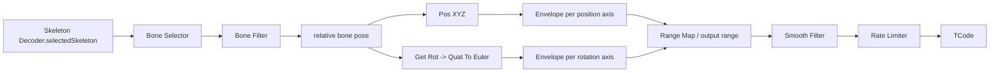
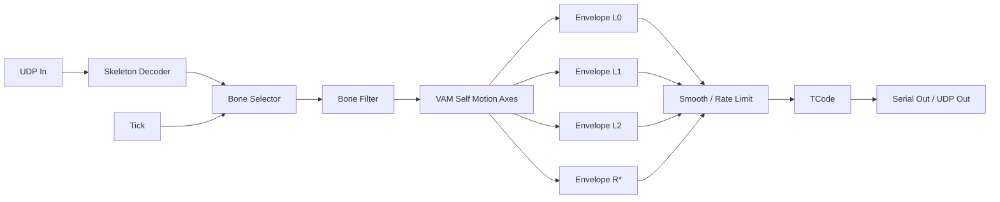
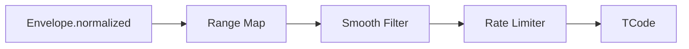

# VAM (3): Self-Motion Fallback

This tutorial extracts motion from one skeleton bone and turns it into TCode.
It is based on the design in `D:\vam_dancing.json`.

This branch is the safest fallback in the VAM family because it only needs:

```text
one skeleton
one bone
one stable update stream
```

It does not need a shaft reference and it does not need a second contact target.
That makes it a good `self` branch for the unified VAM graph.

## Design From `vam_dancing.json`

The existing graph follows this idea:



The important part is `Bone Filter.relative`:

```text
raw bone pose - low-frequency filtered bone pose = high-frequency local motion
```

In other words:

- the filter output is the low-frequency trajectory;
- the `relative` output is the high-frequency residual expressed in filtered
  local space;
- envelopes estimate lower and upper bounds;
- normalized values are mapped, shaped, and sent to TCode.

## Recommended Graph



Studio wiring:

```text
UDP In.packet -> Skeleton Decoder.packet
Skeleton Decoder.selectedSkeleton -> Bone Selector.skeleton
Bone Selector.bone -> Bone Filter.bone
Bone Filter.relative -> VAM Self Motion Axes.relativeBone
Tick.exec -> VAM Self Motion Axes.exec

VAM Self Motion Axes.L0_vertical_m -> Envelope.value
VAM Self Motion Axes.L1_forward_m -> Envelope.value
VAM Self Motion Axes.L2_side_m -> Envelope.value
VAM Self Motion Axes.R0_yaw_deg -> Envelope.value
VAM Self Motion Axes.R1_pitch_deg -> Envelope.value
VAM Self Motion Axes.R2_roll_deg -> Envelope.value

Envelope.normalized -> Range Map.value
Range Map.value -> Smooth Filter.value
Smooth Filter.value -> Rate Limiter.value
Rate Limiter.value -> TCode.<axis>
```

## Layer Contract

| Layer | Input | Output | Owns |
| --- | --- | --- | --- |
| Ingest | UDP packet | selected skeleton | packet decoding and skeleton cache |
| Bone selection | skeleton | one bone | choosing the tracked body point |
| Low/high split | one bone | filtered and relative bone | low-frequency baseline and high-frequency residual |
| Self axes | relative bone | raw local motion axes | local position/rotation decomposition |
| Envelope | raw axis | normalized `0..1` value | adaptive lower/upper range estimation |
| Shaping | normalized axis | processed `0..1` command | smoothing, rate limiting, output range |
| Output | processed commands | TCode string | command packaging and transport |

## Tutorial: Build The Graph From Zero

### 1. Create The Ingest And Bone Nodes

Create:

| Node | Setup |
| --- | --- |
| `UDP In` | Use the port from `ignore/Feel8.SkeletonStreamer`. |
| `Skeleton Decoder` | Set `selectedKey` to the actor you want to track once the stream is visible. |
| `Bone Selector` | Set `target` to the bone to track, for example `Vagina`, `Anus`, `Chest`, or `Hips`. |
| `Bone Filter` | Start with `filter_type=EMA`, `ema_alpha=0.1`. |
| `Tick` | Start around `30..60 Hz`. |

Wire:

```text
UDP In.packet -> Skeleton Decoder.packet
Skeleton Decoder.selectedSkeleton -> Bone Selector.skeleton
Bone Selector.bone -> Bone Filter.bone
```

The `Bone Filter.relative` output is the useful signal. It is the current bone
pose relative to its smoothed low-frequency baseline.

### 2. Add `VAM Self Motion Axes`

Create a `Python Script` node and rename it to `VAM Self Motion Axes`.

Set `inputMode` to:

```text
raw_dict
```

Add data input ports:

| Port | Purpose |
| --- | --- |
| `relativeBone` | Connect from `Bone Filter.relative`. |

Add data output ports:

| Port | Meaning |
| --- | --- |
| `L0_vertical_m` | Local vertical residual motion. |
| `L1_forward_m` | Local forward/back residual motion. |
| `L2_side_m` | Local side residual motion. |
| `R0_yaw_deg` | Local yaw residual. |
| `R1_pitch_deg` | Local pitch residual. |
| `R2_roll_deg` | Local roll residual. |
| `motionAmplitude_m` | Position residual magnitude. |
| `rotationAmplitude_deg` | Rotation residual magnitude. |
| `confidence` | Activity-like score for mode arbitration. |
| `axes` | Combined raw axis object. |
| `status` | Validity/status object. |

Add state fields:

| State field | Type | Default | Purpose |
| --- | --- | --- | --- |
| `activityPosScale` | number | `0.08` | Position amplitude that counts as high activity. |
| `activityRotScaleDeg` | number | `35.0` | Rotation amplitude that counts as high activity. |
| `confidenceSmoothing` | number | `0.25` | EMA smoothing for confidence. |

Wire:

```text
Bone Filter.relative -> VAM Self Motion Axes.relativeBone
Tick.exec -> VAM Self Motion Axes.exec
```

Paste this script:

```python
from __future__ import annotations

import math
from typing import TYPE_CHECKING, Any

if TYPE_CHECKING:
    from f8_script_api import F8Inputs, F8PyEngineContext

Vec3 = tuple[float, float, float]
Quat = tuple[float, float, float, float]
EPS = 1.0e-8


def _state_float(ctx: "F8PyEngineContext", field: str, default: float) -> float:
    value = ctx.states.get(field, default)
    if isinstance(value, bool) or value is None:
        return default
    if isinstance(value, (int, float)):
        return float(value)
    if isinstance(value, str):
        text = value.strip()
        if not text:
            return default
        try:
            return float(text)
        except ValueError:
            return default
    return default


def _as_vec3(value: Any, label: str) -> Vec3:
    if not isinstance(value, (list, tuple)) or len(value) < 3:
        raise ValueError(f"{label} must be a 3-element vector")
    return (float(value[0]), float(value[1]), float(value[2]))


def _as_quat(value: Any, label: str) -> Quat:
    if not isinstance(value, (list, tuple)) or len(value) < 4:
        raise ValueError(f"{label} must be a 4-element quaternion [w, x, y, z]")
    return _quat_normalize((float(value[0]), float(value[1]), float(value[2]), float(value[3])))


def _quat_normalize(q: Quat) -> Quat:
    norm = math.sqrt(q[0] * q[0] + q[1] * q[1] + q[2] * q[2] + q[3] * q[3])
    if norm <= EPS:
        return (1.0, 0.0, 0.0, 0.0)
    return (q[0] / norm, q[1] / norm, q[2] / norm, q[3] / norm)


def _clamp01(value: float) -> float:
    return max(0.0, min(1.0, value))


def _quat_to_euler_zyx_deg(q: Quat) -> tuple[float, float, float]:
    w, x, y, z = _quat_normalize(q)
    sinr_cosp = 2.0 * (w * x + y * z)
    cosr_cosp = 1.0 - 2.0 * (x * x + y * y)
    roll = math.atan2(sinr_cosp, cosr_cosp)

    sinp = 2.0 * (w * y - z * x)
    if abs(sinp) >= 1.0:
        pitch = math.copysign(math.pi / 2.0, sinp)
    else:
        pitch = math.asin(sinp)

    siny_cosp = 2.0 * (w * z + x * y)
    cosy_cosp = 1.0 - 2.0 * (y * y + z * z)
    yaw = math.atan2(siny_cosp, cosy_cosp)
    return (yaw * 180.0 / math.pi, pitch * 180.0 / math.pi, roll * 180.0 / math.pi)


def _invalid(reason: str) -> dict[str, Any]:
    axes = {
        "valid": False,
        "reason": reason,
        "L0_vertical_m": 0.0,
        "L1_forward_m": 0.0,
        "L2_side_m": 0.0,
        "R0_yaw_deg": 0.0,
        "R1_pitch_deg": 0.0,
        "R2_roll_deg": 0.0,
        "confidence": 0.0,
    }
    return {
        "L0_vertical_m": 0.0,
        "L1_forward_m": 0.0,
        "L2_side_m": 0.0,
        "R0_yaw_deg": 0.0,
        "R1_pitch_deg": 0.0,
        "R2_roll_deg": 0.0,
        "motionAmplitude_m": 0.0,
        "rotationAmplitude_deg": 0.0,
        "confidence": 0.0,
        "axes": axes,
        "status": {"valid": False, "reason": reason, "confidence": 0.0},
    }


def _run_axes(ctx: "F8PyEngineContext", inputs: dict[str, Any]) -> dict[str, Any]:
    bone = inputs.get("relativeBone")
    if not isinstance(bone, dict):
        return _invalid("relativeBone input is missing")
    pos = _as_vec3(bone.get("pos"), "relativeBone.pos")
    rot = _as_quat(bone.get("rot"), "relativeBone.rot")

    yaw_deg, pitch_deg, roll_deg = _quat_to_euler_zyx_deg(rot)
    side_m = pos[0]
    vertical_m = pos[1]
    forward_m = pos[2]
    motion_amplitude = math.sqrt(side_m * side_m + vertical_m * vertical_m + forward_m * forward_m)
    rotation_amplitude = math.sqrt(yaw_deg * yaw_deg + pitch_deg * pitch_deg + roll_deg * roll_deg)

    pos_scale = max(EPS, _state_float(ctx, "activityPosScale", 0.08))
    rot_scale = max(EPS, _state_float(ctx, "activityRotScaleDeg", 35.0))
    raw_confidence = max(_clamp01(motion_amplitude / pos_scale), _clamp01(rotation_amplitude / rot_scale))
    smoothing = _clamp01(_state_float(ctx, "confidenceSmoothing", 0.25))
    previous_raw = ctx.locals.get("confidence")
    previous = float(previous_raw) if isinstance(previous_raw, (int, float)) else raw_confidence
    confidence = previous + (raw_confidence - previous) * smoothing
    ctx.locals["confidence"] = confidence

    axes = {
        "valid": True,
        "L0_vertical_m": float(vertical_m),
        "L1_forward_m": float(forward_m),
        "L2_side_m": float(side_m),
        "R0_yaw_deg": float(yaw_deg),
        "R1_pitch_deg": float(pitch_deg),
        "R2_roll_deg": float(roll_deg),
        "motionAmplitude_m": float(motion_amplitude),
        "rotationAmplitude_deg": float(rotation_amplitude),
        "confidence": float(confidence),
    }
    return {
        "L0_vertical_m": axes["L0_vertical_m"],
        "L1_forward_m": axes["L1_forward_m"],
        "L2_side_m": axes["L2_side_m"],
        "R0_yaw_deg": axes["R0_yaw_deg"],
        "R1_pitch_deg": axes["R1_pitch_deg"],
        "R2_roll_deg": axes["R2_roll_deg"],
        "motionAmplitude_m": axes["motionAmplitude_m"],
        "rotationAmplitude_deg": axes["rotationAmplitude_deg"],
        "confidence": axes["confidence"],
        "axes": axes,
        "status": {"valid": True, "confidence": axes["confidence"], "reason": "self motion active"},
    }


def onStart(ctx: "F8PyEngineContext") -> None:
    ctx.log("VAM Self Motion Axes started")


def onMsg(ctx: "F8PyEngineContext", inputs: "F8Inputs") -> dict[str, Any]:
    outputs = _run_axes(ctx, inputs)
    return {"outputs": outputs}


def onExec(ctx: "F8PyEngineContext", exec_in: str, inputs: "F8Inputs") -> dict[str, Any]:
    outputs = _run_axes(ctx, inputs)
    return {"exec": ["exec"], "outputs": outputs}


def onStop(ctx: "F8PyEngineContext") -> None:
    ctx.log("VAM Self Motion Axes stopped")
```

### 3. Add Envelopes For Adaptive Range Estimation

Add one `Envelope` node per axis. This matches the existing
`D:\vam_dancing.json` design.

Recommended first settings:

| Axis group | Method | `rise_alpha` | `fall_alpha` | `min_span` | Notes |
| --- | --- | --- | --- | --- | --- |
| position axes | `EMA` | `0.4` | `0.05` | `0.03` | Tracks lower/upper motion envelope. |
| rotation axes | `EMA` | `0.4` | `0.05` | `0.5` | Rotation spans are larger and noisier. |

Wire:

```text
VAM Self Motion Axes.L0_vertical_m -> Envelope L0.value
VAM Self Motion Axes.L1_forward_m -> Envelope L1.value
VAM Self Motion Axes.L2_side_m -> Envelope L2.value
VAM Self Motion Axes.R0_yaw_deg -> Envelope R0.value
VAM Self Motion Axes.R1_pitch_deg -> Envelope R1.value
VAM Self Motion Axes.R2_roll_deg -> Envelope R2.value
```

Then use:

```text
Envelope.normalized -> Range Map.value
```

`Envelope.normalized` is already `0..1`. Use `Range Map` after it for output
range, inversion, or centering.

### 4. Shape And Output

The post-processing chain is the same as VAM (1) and VAM (2):



Start with:

```text
Envelope.normalized -> Range Map.value
Range Map.value -> Smooth Filter.value
Smooth Filter.value -> Rate Limiter.value
Rate Limiter.value -> TCode.<axis>
```

For a conservative first output:

| TCode axis | Source |
| --- | --- |
| `L0` | `L0_vertical_m` envelope |
| `L1` | `L1_forward_m` envelope |
| `L2` | `L2_side_m` envelope |
| `R0` | optional `R0_yaw_deg` envelope |
| `R1` | optional `R1_pitch_deg` envelope |
| `R2` | optional `R2_roll_deg` envelope |

If the output feels too active, narrow the `Range Map` output range, for
example `0.35..0.65`, before raising device speed or actuator range.

## Why This Branch Is The Fallback

VAM (1) needs a shaft reference. VAM (2) needs two contact-capable skeletons.
VAM (3) needs only one valid bone.

That makes the branch useful when:

- only one VAM character is present;
- the scene is dancing, posing, or idle animation;
- no shaft/contact interpretation is reliable;
- the unified arbiter needs a stable fallback mode.

Recommended arbiter semantics:

```text
self.valid = selected bone exists and VAM Self Motion Axes.status.valid is true
self.confidence = VAM Self Motion Axes.confidence
```

The self branch should not usually steal control from a confident shaft or
contact branch. It should win when the other branches are invalid or low
confidence.
