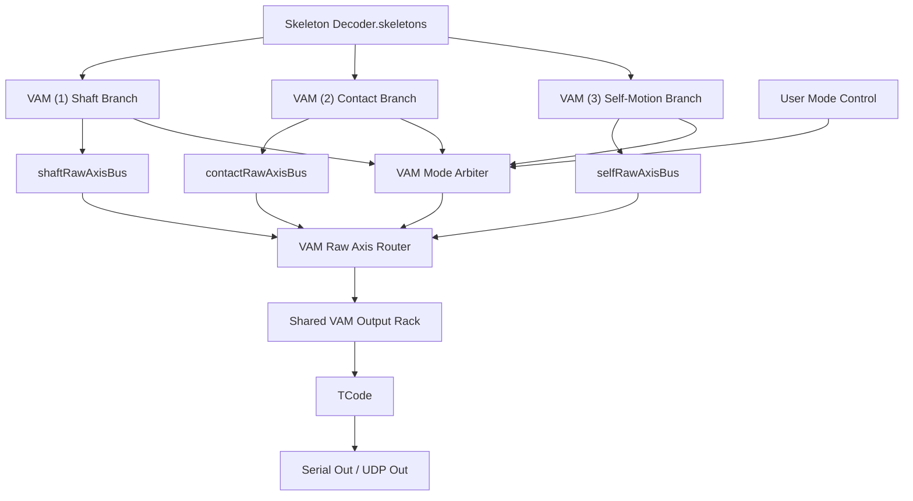

# VAM (4): Unified Mode Arbiter

This tutorial combines the three VAM branches:

- VAM (1) shaft branch: male/dildo reference to target.
- VAM (2) contact branch: female-female surface contact.
- VAM (3) self-motion branch: single-bone dance/fallback motion.

The unified graph should not force all branches to share one reference model.
They do not mean the same thing. Instead, each branch owns its own geometry and
emits a compatible raw axis bus.

The key rule is:

```text
branch owns geometry
shared output rack owns feel
```

## Unified Graph



The important contract is:

```text
branch-specific geometry -> branch-specific raw axes -> routed raw axis bus -> shared conditioning rack -> TCode
```

Do not let the three branches write directly to the same TCode node. Let exactly
one branch pass through the raw router, then apply normalization, output range,
smoothing, and rate limiting in one shared place.

## Mode Strategy

Do not start with full automation. Use three stages:

| Stage | `modeControl` | Behavior |
| --- | --- | --- |
| Manual | `manual` | User selects `manualMode`. Most reliable while building the graph. |
| Assist | `assist` | Arbiter outputs `suggestedMode` and confidence, but does not switch the output. |
| Auto | `auto` | Arbiter switches with confidence margin and minimum hold time. |

Recommended default:

```text
modeControl = assist
manualMode = shaft
```

This keeps the user in control while showing what the automatic system would do.

## Branch Confidence

Each branch should output a small status object:

```json
{
  "valid": true,
  "confidence": 0.75,
  "reason": "branch-specific reason"
}
```

Suggested first confidence meanings:

| Branch | Valid when | Confidence means |
| --- | --- | --- |
| `shaft` | Reference and target are resolved. | Target is close to useful shaft geometry. |
| `contact` | Two contact-capable skeletons and selected bones are resolved. | Contact distance and/or slide activity are strong. |
| `self` | Selected bone exists and self-motion axes are valid. | One-bone residual activity is present. |

The `self` branch is the fallback. It should usually win only when `shaft` and
`contact` are invalid or low confidence.

## Raw Axis Bus

Before the router, convert each branch to a raw semantic bus. The bus values are
not final device commands and should not be clamped to `0..1` yet.

Recommended compact shape:

```json
{
  "valid": true,
  "mode": "shaft",
  "confidence": 0.82,
  "L0": 0.52,
  "L1": -0.04,
  "L2": 0.02,
  "R0": 12.0,
  "R1": -8.0,
  "R2": 0.0,
  "units": {
    "L0": "fraction",
    "L1": "m",
    "L2": "m",
    "R0": "deg",
    "R1": "deg",
    "R2": "deg"
  },
  "reason": "shaft target locked"
}
```

Nested shape is also acceptable if a branch wants richer metadata:

```json
{
  "valid": true,
  "mode": "contact",
  "confidence": 0.71,
  "axes": {
    "L0": {"value": 0.08, "unit": "m", "semantic": "contact_distance"},
    "L1": {"value": -0.03, "unit": "m", "semantic": "slide_forward"},
    "L2": {"value": 0.01, "unit": "m", "semantic": "slide_right"}
  },
  "reason": "contact pair locked"
}
```

The shared output rack decides how each raw value becomes a normalized command.
This keeps the branch tutorials focused on geometry and gives the user one
consistent place to tune output feel.

## `VAM Mode Arbiter`

Create a `Python Script` node named `VAM Mode Arbiter`.

Set `inputMode` to:

```text
raw_dict
```

Add data input ports:

| Port | Purpose |
| --- | --- |
| `shaftStatus` | VAM (1) status or raw axis bus. |
| `contactStatus` | VAM (2) status or raw axis bus. |
| `selfStatus` | VAM (3) status or raw axis bus. |

Add data output ports:

| Port | Purpose |
| --- | --- |
| `selectedMode` | `shaft`, `contact`, `self`, or `neutral`. |
| `suggestedMode` | Highest-confidence valid mode. |
| `status` | Full arbiter status. |

Add state fields:

| State field | Type | Default | Purpose |
| --- | --- | --- | --- |
| `modeControl` | string | `assist` | `manual`, `assist`, or `auto`. |
| `manualMode` | string | `shaft` | Used when `modeControl=manual` or `assist`. |
| `switchMargin` | number | `0.15` | New mode must beat current confidence by this much. |
| `minHoldMs` | number | `1500` | Minimum time to hold a selected auto mode. |
| `shaftMinConfidence` | number | `0.35` | Minimum usable shaft confidence. |
| `contactMinConfidence` | number | `0.35` | Minimum usable contact confidence. |
| `selfMinConfidence` | number | `0.10` | Minimum usable self confidence. |
| `fallbackMode` | string | `self` | `self`, `neutral`, or `hold`. |

Paste this script:

```python
from __future__ import annotations

from typing import TYPE_CHECKING, Any

if TYPE_CHECKING:
    from f8_script_api import F8Inputs, F8PyEngineContext

MODES = ("shaft", "contact", "self")


def _state_text(ctx: "F8PyEngineContext", field: str, default: str) -> str:
    value = ctx.states.get(field, default)
    if value is None:
        return default
    return str(value).strip().lower()


def _state_float(ctx: "F8PyEngineContext", field: str, default: float) -> float:
    value = ctx.states.get(field, default)
    if isinstance(value, bool) or value is None:
        return default
    if isinstance(value, (int, float)):
        return float(value)
    if isinstance(value, str):
        text = value.strip()
        if not text:
            return default
        try:
            return float(text)
        except ValueError:
            return default
    return default


def _now_ms(ts_ms: int | None) -> int:
    if ts_ms is None:
        return 0
    return int(ts_ms)


def _confidence(value: Any) -> float:
    if not isinstance(value, dict):
        return 0.0
    if value.get("valid") is not True:
        return 0.0
    raw = value.get("confidence", 1.0)
    if isinstance(raw, bool) or raw is None:
        return 0.0
    if isinstance(raw, (int, float)):
        return max(0.0, min(1.0, float(raw)))
    if isinstance(raw, str):
        text = raw.strip()
        if not text:
            return 0.0
        try:
            return max(0.0, min(1.0, float(text)))
        except ValueError:
            return 0.0
    return 0.0


def _valid_modes(ctx: "F8PyEngineContext", statuses: dict[str, Any]) -> dict[str, float]:
    minimums = {
        "shaft": _state_float(ctx, "shaftMinConfidence", 0.35),
        "contact": _state_float(ctx, "contactMinConfidence", 0.35),
        "self": _state_float(ctx, "selfMinConfidence", 0.10),
    }
    values: dict[str, float] = {}
    for mode in MODES:
        confidence = _confidence(statuses.get(mode))
        if confidence >= minimums[mode]:
            values[mode] = confidence
    return values


def _best_mode(values: dict[str, float]) -> tuple[str, float]:
    if not values:
        return "neutral", 0.0
    ordered = sorted(values.items(), key=lambda item: (-item[1], item[0]))
    return ordered[0][0], ordered[0][1]


def _select_auto(ctx: "F8PyEngineContext", values: dict[str, float], now_ms: int) -> tuple[str, str]:
    current_raw = ctx.locals.get("selected_mode")
    current = current_raw if isinstance(current_raw, str) else ""
    selected_since_raw = ctx.locals.get("selected_since_ms")
    selected_since = int(selected_since_raw) if isinstance(selected_since_raw, int) else now_ms
    best, best_confidence = _best_mode(values)
    if best == "neutral":
        fallback = _state_text(ctx, "fallbackMode", "self")
        if fallback == "hold" and current:
            return current, "auto fallback hold"
        if fallback in MODES and fallback in values:
            return fallback, f"auto fallback {fallback}"
        return "neutral", "auto no valid mode"

    if current not in values:
        ctx.locals["selected_since_ms"] = now_ms
        return best, f"auto selected {best}; previous invalid"

    min_hold_ms = max(0.0, _state_float(ctx, "minHoldMs", 1500.0))
    if now_ms > 0 and now_ms - selected_since < min_hold_ms:
        return current, f"auto hold {current}; minHoldMs"

    current_confidence = values[current]
    margin = max(0.0, _state_float(ctx, "switchMargin", 0.15))
    if best != current and best_confidence >= current_confidence + margin:
        ctx.locals["selected_since_ms"] = now_ms
        return best, f"auto switched {current}->{best}"
    return current, f"auto kept {current}"


def _run_arbiter(ctx: "F8PyEngineContext", inputs: dict[str, Any], ts_ms: int | None) -> dict[str, Any]:
    statuses = {
        "shaft": inputs.get("shaftStatus"),
        "contact": inputs.get("contactStatus"),
        "self": inputs.get("selfStatus"),
    }
    values = _valid_modes(ctx, statuses)
    suggested_mode, suggested_confidence = _best_mode(values)
    mode_control = _state_text(ctx, "modeControl", "assist")
    manual_mode = _state_text(ctx, "manualMode", "shaft")
    now_ms = _now_ms(ts_ms)

    if mode_control == "manual":
        selected = manual_mode if manual_mode in MODES else "neutral"
        reason = f"manual {selected}"
    elif mode_control == "assist":
        selected = manual_mode if manual_mode in MODES else "neutral"
        reason = f"assist selected manual {selected}; suggested {suggested_mode}"
    elif mode_control == "auto":
        selected, reason = _select_auto(ctx, values, now_ms)
    else:
        selected = manual_mode if manual_mode in MODES else "neutral"
        reason = f"unknown modeControl; using manualMode {selected}"

    ctx.locals["selected_mode"] = selected
    status = {
        "valid": selected in MODES,
        "modeControl": mode_control,
        "selectedMode": selected,
        "suggestedMode": suggested_mode,
        "selectedConfidence": float(values.get(selected, 0.0)),
        "suggestedConfidence": float(suggested_confidence),
        "shaftConfidence": float(values.get("shaft", 0.0)),
        "contactConfidence": float(values.get("contact", 0.0)),
        "selfConfidence": float(values.get("self", 0.0)),
        "reason": reason,
    }
    return {"selectedMode": selected, "suggestedMode": suggested_mode, "status": status}


def onStart(ctx: "F8PyEngineContext") -> None:
    ctx.log("VAM Mode Arbiter started")


def onMsg(ctx: "F8PyEngineContext", inputs: "F8Inputs") -> dict[str, Any]:
    outputs = _run_arbiter(ctx, inputs, None)
    return {"outputs": outputs}


def onExec(ctx: "F8PyEngineContext", exec_in: str, inputs: "F8Inputs") -> dict[str, Any]:
    ts_ms_raw = inputs.get("tickMs")
    ts_ms = int(ts_ms_raw) if isinstance(ts_ms_raw, (int, float)) else None
    outputs = _run_arbiter(ctx, inputs, ts_ms)
    return {"exec": ["exec"], "outputs": outputs}


def onStop(ctx: "F8PyEngineContext") -> None:
    ctx.log("VAM Mode Arbiter stopped")
```

## `VAM Raw Axis Router`

Create another `Python Script` node named `VAM Raw Axis Router`.

Set `inputMode` to:

```text
raw_dict
```

Add data input ports:

| Port | Purpose |
| --- | --- |
| `selectedMode` | From `VAM Mode Arbiter.selectedMode`. |
| `shaftRawAxes` | Raw axis bus from VAM (1). |
| `contactRawAxes` | Raw axis bus from VAM (2). |
| `selfRawAxes` | Raw axis bus from VAM (3). |

Add data output ports:

| Port | Purpose |
| --- | --- |
| `L0_raw` | Routed raw L0 value. |
| `L1_raw` | Routed raw L1 value. |
| `L2_raw` | Routed raw L2 value. |
| `R0_raw` | Routed raw R0 value. |
| `R1_raw` | Routed raw R1 value. |
| `R2_raw` | Routed raw R2 value. |
| `rawAxes` | Combined routed raw axis object. |
| `status` | Routing status. |

Paste this script:

```python
from __future__ import annotations

from typing import TYPE_CHECKING, Any

if TYPE_CHECKING:
    from f8_script_api import F8Inputs, F8PyEngineContext

AXES = ("L0", "L1", "L2", "R0", "R1", "R2")


def _number(value: Any, default: float) -> float:
    if isinstance(value, bool) or value is None:
        return default
    if isinstance(value, (int, float)):
        return float(value)
    if isinstance(value, str):
        text = value.strip()
        if not text:
            return default
        try:
            return float(text)
        except ValueError:
            return default
    return default


def _axis_bus(value: Any) -> dict[str, Any]:
    if isinstance(value, dict):
        return value
    return {}


def _select_bus(inputs: dict[str, Any], mode: str) -> tuple[dict[str, Any], str]:
    if mode == "shaft":
        return _axis_bus(inputs.get("shaftRawAxes")), "shaft"
    if mode == "contact":
        return _axis_bus(inputs.get("contactRawAxes")), "contact"
    if mode == "self":
        return _axis_bus(inputs.get("selfRawAxes")), "self"
    return {}, "neutral"


def _nested_axis_value(bus: dict[str, Any], axis: str) -> float | None:
    axes = bus.get("axes")
    if not isinstance(axes, dict):
        return None
    axis_payload = axes.get(axis)
    if isinstance(axis_payload, dict):
        return _number(axis_payload.get("value"), 0.0)
    if axis_payload is not None:
        return _number(axis_payload, 0.0)
    return None


def _axis_value(bus: dict[str, Any], axis: str) -> float:
    nested = _nested_axis_value(bus, axis)
    if nested is not None:
        return nested
    return _number(bus.get(axis), 0.0)


def _axis_unit(bus: dict[str, Any], axis: str) -> str:
    units = bus.get("units")
    if isinstance(units, dict):
        return str(units.get(axis) or "")
    axes = bus.get("axes")
    if isinstance(axes, dict):
        axis_payload = axes.get(axis)
        if isinstance(axis_payload, dict):
            return str(axis_payload.get("unit") or "")
    return ""


def _run_router(ctx: "F8PyEngineContext", inputs: dict[str, Any]) -> dict[str, Any]:
    del ctx
    mode_raw = inputs.get("selectedMode")
    mode = str(mode_raw or "neutral").strip().lower()
    bus, selected = _select_bus(inputs, mode)
    valid = bool(bus.get("valid") is True)
    raw_axes: dict[str, Any] = {
        "valid": valid,
        "mode": selected,
        "confidence": _number(bus.get("confidence"), 0.0),
        "reason": str(bus.get("reason") or ""),
        "units": {},
    }
    units = raw_axes["units"]
    outputs: dict[str, Any] = {}
    if isinstance(units, dict):
        for axis in AXES:
            value = _axis_value(bus, axis)
            raw_axes[axis] = value
            units[axis] = _axis_unit(bus, axis)
            outputs[f"{axis}_raw"] = value
    outputs["rawAxes"] = raw_axes
    outputs["status"] = {"valid": valid, "selectedMode": selected, "reason": raw_axes["reason"]}
    return outputs


def onStart(ctx: "F8PyEngineContext") -> None:
    ctx.log("VAM Raw Axis Router started")


def onMsg(ctx: "F8PyEngineContext", inputs: "F8Inputs") -> dict[str, Any]:
    outputs = _run_router(ctx, inputs)
    return {"outputs": outputs}


def onExec(ctx: "F8PyEngineContext", exec_in: str, inputs: "F8Inputs") -> dict[str, Any]:
    outputs = _run_router(ctx, inputs)
    return {"exec": ["exec"], "outputs": outputs}


def onStop(ctx: "F8PyEngineContext") -> None:
    ctx.log("VAM Raw Axis Router stopped")
```

## Shared VAM Output Rack

The shared rack is where the user controls range, inversion, smoothing, and
rate. Every VAM mode should pass through this same shape.


Use one lane per TCode axis:

```text
VAM Raw Axis Router.L0_raw -> Axis Normalize L0.value
Axis Normalize L0.norm01 -> Range Map L0.value
Range Map L0.value -> Smooth Filter L0.value
Smooth Filter L0.value -> Rate Limiter L0.value
Rate Limiter L0.value -> TCode.L0
```

`Axis Normalize` can be implemented with ordinary `Range Map` nodes at first.
For adaptive scenes, use `Envelope` or the adaptive normalizer from VAM (2) as
the normalize step. The important part is that all of these choices live in the
same rack, not hidden inside each branch.

Recommended first profiles:

| Mode | Axis | Normalize method | Starting range | Notes |
| --- | --- | --- | --- | --- |
| `shaft` | `L0` | fixed `Range Map` | `0..1` | Shaft fraction or penetration geometry. |
| `shaft` | `L1/L2` | fixed `Range Map` | `-0.15..0.15 m` | Side/forward offsets. |
| `shaft` | `R0` | fixed `Range Map` | `-90..90 deg` | Twist. |
| `shaft` | `R1/R2` | fixed `Range Map` | `-30..30 deg` | Bend. |
| `contact` | `L0` | adaptive or fixed | `0.00..0.20 m`, inverted | Close contact becomes high output. |
| `contact` | `L1/L2` | adaptive or fixed | `-0.15..0.15 m` | Sliding axes. |
| `self` | `L*` | envelope/adaptive | scene dependent | Residual local motion. |
| `self` | `R*` | envelope/adaptive | scene dependent | Residual local rotation. |

After normalization, `Range Map` is still useful as an output trim:

| User control | Where to apply |
| --- | --- |
| Output ceiling/floor | `Range Map.outMin/outMax` after normalization. |
| Axis inversion | Swap output min/max or enable invert in the normalizer. |
| Dead zone | `Data Expr` or small script between normalize and output range. |
| Smoothing | `Smooth Filter` after output range for device-space smoothing. |
| Speed limit | `Rate Limiter` after all mixing and overrides. |

Only the final post-processed `0..1` command values should reach `TCode`.

## Building Raw Axis Buses

Each branch can use a small `Data Expr` or Python Script to pack raw outputs
into the common bus. The compact shape should be:

```python
{
    "valid": True,
    "mode": "self",
    "confidence": confidence,
    "L0": L0_raw,
    "L1": L1_raw,
    "L2": L2_raw,
    "R0": R0_raw,
    "R1": R1_raw,
    "R2": R2_raw,
    "units": {
        "L0": "m",
        "L1": "m",
        "L2": "m",
        "R0": "deg",
        "R1": "deg",
        "R2": "deg",
    },
    "reason": "self fallback active",
}
```

Keep these values raw and semantic. Do not apply final device output range,
smoothing, or rate limiting before the router.

## Recommended Rollout

1. Build VAM (1), VAM (2), and VAM (3) independently.
2. Pack each branch into a raw axis bus.
3. Add the arbiter in `assist` mode and observe `suggestedMode`.
4. Add the raw axis router, still using `manual` or `assist`.
5. Build one shared output rack and connect it to TCode.
6. Enable `auto` only after the confidence values look stable.

This gives graph authors a stable mental model:

```text
VAM branch = recognize motion
Shared rack = tune feel
TCode = emit device command
```
