# Studio (GUI)

`f8pystudio` 是图形化的节点编排环境，用于搭建、调试、运行服务图（service graph）。

## 启动

推荐通过 pixi 环境启动：

```bash
pixi run -e default f8pystudio
```

如需强制实时发现（忽略静态 `describe.json` 快路径）：

```bash
python -m f8pystudio.main --discovery-live
```

## 界面速览

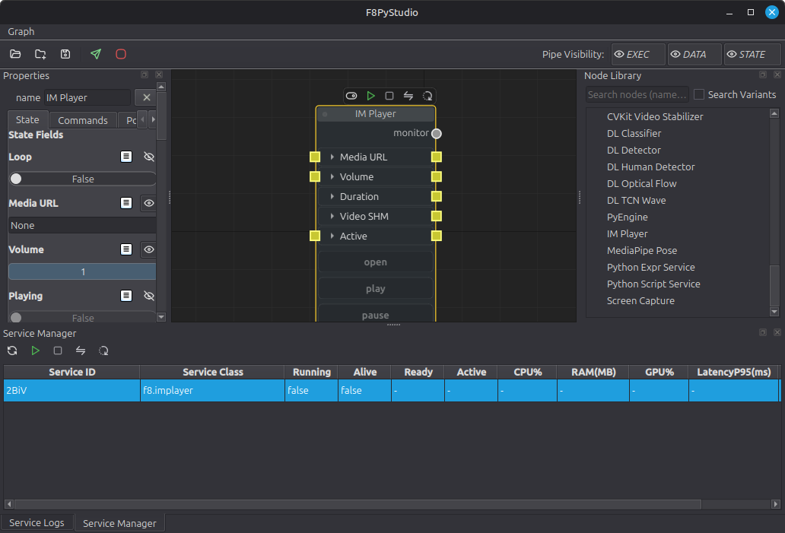

主界面可以理解为 5 个区域：

1. 顶部工具栏：会话文件操作（加载/插入/保存）、发送图（`F5`）、停止全部服务。
2. 中央画布：Node Graph 编辑区，负责连接和布局。
3. 左侧 Properties：当前节点配置（State / Commands / Port / Node）。
4. 右侧 Node Library：节点检索与投放。
5. 底部 Service Logs / Service Manager：日志与服务运行状态。

## 节点类型

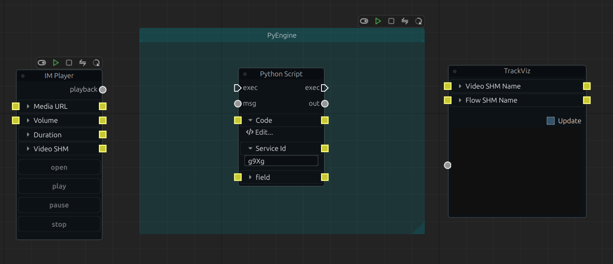

Studio 里常见三类节点：

1. `Service Node`（服务节点）
2. `Operator Node`（算子节点）
3. `UI Node`（`f8.pystudio.*` 可视化节点）

关键约束：

1. Operator 必须绑定到一个容器服务（通常是 `f8.pyengine`），即 `Service Id` 需要指向容器节点 `id`。
2. UI 节点属于 `f8.pystudio` 本地服务，常用于可视化和监控。
3. 跨服务通信通过 rungraph/NATS 完成，不是共享内存式直接调用。

## 5 分钟快速上手

下面用一条最小流程（与截图风格一致）快速体验：

1. 启动 Studio，按 `Tab` 打开快速搜索。
2. 从 Node Library 放置节点：`IM Player`、`PyEngine`、`Python Script`、`TrackViz`。
3. 选中 `Python Script`，在左侧 `State` 里把 `Service Id` 设为 `PyEngine` 节点的 `id`。
4. 点击 `Code -> Edit...` 打开代码编辑器，填入或修改脚本逻辑。
5. 按端口类型连接节点（见“连线规则”），并配置必要状态字段（如媒体路径、端口名等）。
6. 点击工具栏发送图（纸飞机图标，`F5`）。
7. 用节点顶部小工具条或 `Service Manager` 启动服务，观察 `Running/Alive/Ready/Active` 列与日志输出。

## 连线规则

Studio 有三种独立边类型：

1. `exec`（执行边，白色）
2. `data`（数据边，灰色）
3. `state`（状态边，黄色）

规则如下：

1. 只能同类端口互连：`exec->exec`、`data->data`、`state->state`。
2. `exec` 仅允许同一 `svcId` 下的 Operator 之间连接。
3. `exec` 端口是单入单出（重连会替换旧连接）。
4. `data`/`state` 支持跨服务，但输入端口单入。
5. 加载旧会话时，非法边会被自动剔除并写入警告日志。

你也可以用顶部 `Pipe Visibility` 的 `EXEC / DATA / STATE` 按钮独立隐藏/显示某类边。

## 运行控制与状态

服务节点顶部有进程控制条（禁用/启动或激活/停止/同步/重启）。

不同状态示例：

| 状态 | 截图 | 含义 |
| --- | --- | --- |
| Not Run | 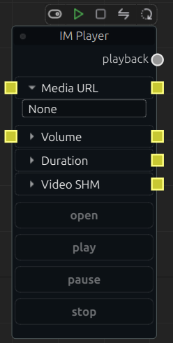 | 进程未启动 |
| Disabled | 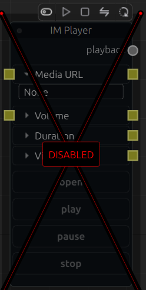 | 节点被禁用，编译与自动启动都会跳过 |
| Running | 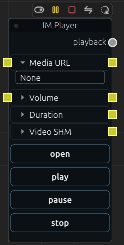 | 进程运行中 |
| Paused | 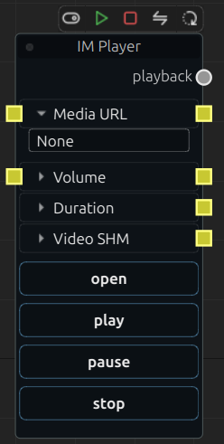 | 进程运行但处于非激活状态 |

`Service Manager` 提供统一控制与监控，包含 CPU/RAM/GPU、延迟和错误统计。

## 属性面板（Properties）

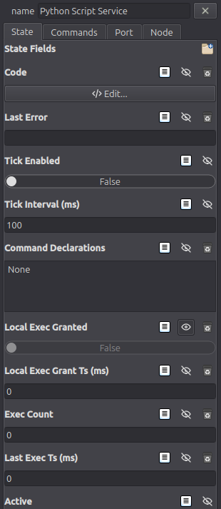

`Properties` 主要有四个标签页：

1. `State`：状态字段与其编辑器入口。
2. `Commands`：可调用命令列表。
3. `Port`：数据输入输出端口定义。
4. `Node`：外观属性（颜色、文本色、边框色等）。

对应截图：

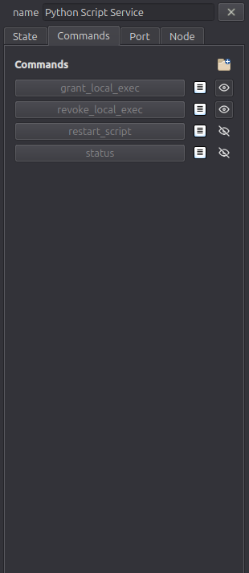
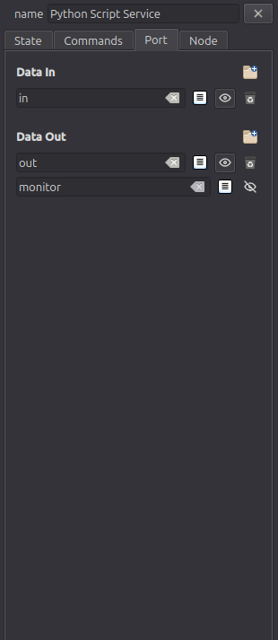
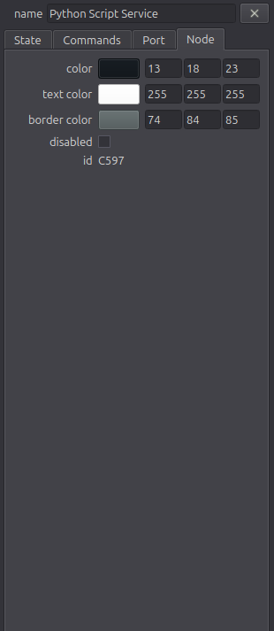

### 字段/命令/端口编辑

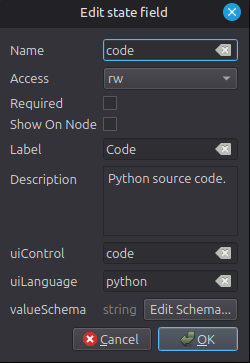
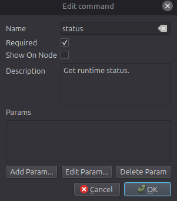
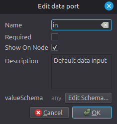

可编辑的核心信息包括：

1. `name`、`description`、`required`、`showOnNode`
2. state 字段的 `access/uiControl/uiLanguage/valueSchema`
3. command 的参数定义（params）
4. data port 的 `valueSchema`

## Schema 编辑器

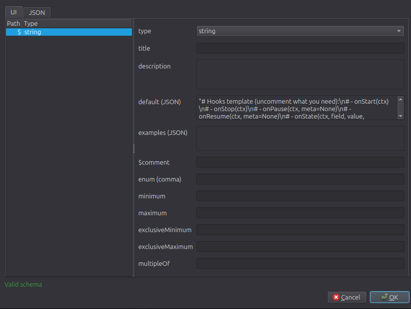
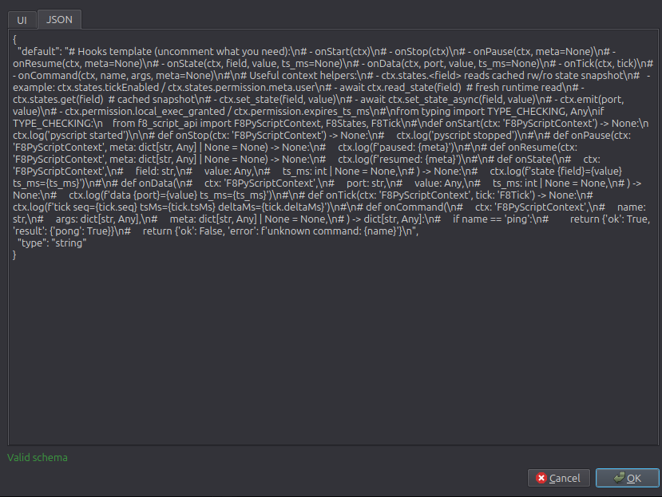

Schema 编辑器提供 `UI` 和 `JSON` 两种视图。`valueSchema` 会用于：

1. 运行时值校验。
2. 属性编辑器呈现。
3. Python 脚本编辑时的补全/提示上下文。

## 代码编辑器（Monaco）

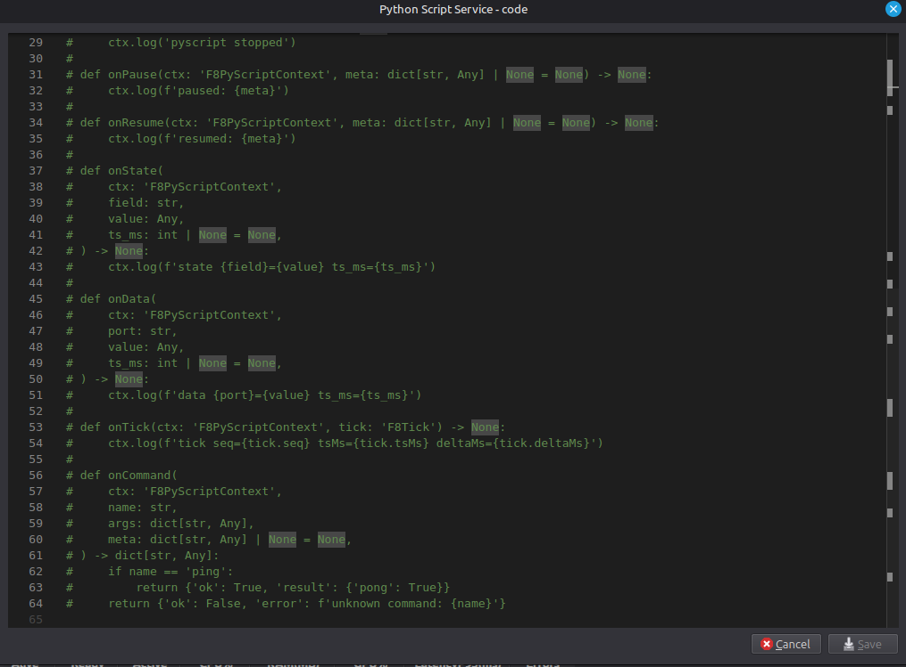

代码编辑器基于 Monaco（VS Code 同源）。常用快捷键：

1. `Ctrl+S` 保存
2. `Ctrl+Q` 关闭
3. `Ctrl+Space` 或 `Ctrl+J` 触发补全
4. `Ctrl+Shift+Space` 或 `Ctrl+Shift+J` 触发参数提示
5. `Esc` 关闭补全面板

## Node Library 与 Variants

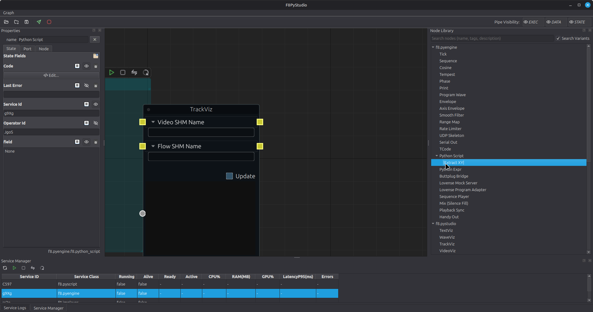

Node Library 支持按名称、标签、描述检索，点击节点后到画布左键放置。右键菜单包含：

1. `Show Details`：查看节点文档与原始 JSON。
2. `Manage Variants...`：打开变体管理器。
3. `Delete Variant...`：删除当前变体（仅变体项可见）。
4. `Variants`：直接选择已有变体投放。

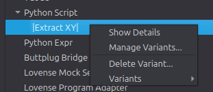
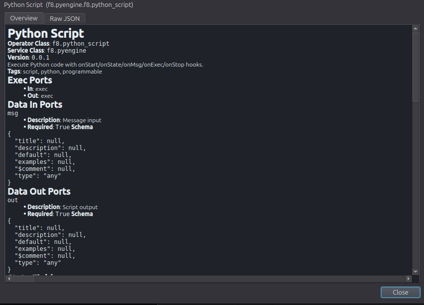
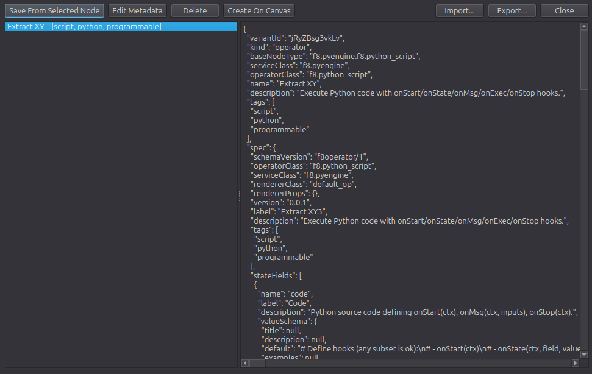

Variants 可导入/导出，默认文件路径：`~/.f8/studio/nodeVariants.json`。

## 常用快捷键

1. `Tab`：打开节点快速搜索
2. `Delete` / `Backspace`：删除选中节点
3. `Esc`：取消节点放置 / 插入图放置
4. `Ctrl+S`：保存当前会话到 `~/.f8/studio/lastSession.json`
5. `Ctrl+O`：加载 `lastSession.json`
6. `Ctrl+Shift+O`：从文件加载会话
7. `Ctrl+Shift+S`：会话另存为
8. `Ctrl+Shift+I`：插入外部图到当前画布
9. `Ctrl+R`：编译并打印 Runtime Graph
10. `F5`：发送图到运行时

画布导航：

1. 鼠标中键拖动画布
2. `W/A/S/D` 或方向键平移
3. `Q/E` 或 `PageUp/PageDown` 缩放

## 会话与 Runner

Studio 会在退出时自动保存最近会话到：`~/.f8/studio/lastSession.json`。

需要无 GUI 执行时，可改用 headless runner：

```bash
python -m f8pysdk.headless_runner --session path/to/session.json
```

## 故障排查

1. 线连不上：先确认端口类型（`[E]/[D]/[S]`）是否匹配；`exec` 不能跨 `svcId`。
2. Deploy/Compile 被拦截：检查是否有缺失依赖节点或 Operator 未设置有效 `Service Id`。
3. 命令按钮灰掉：节点可能 `Disabled`，或服务进程尚未运行。
4. 自动补全不理想：优先补齐 state/data port 的 `valueSchema`。
